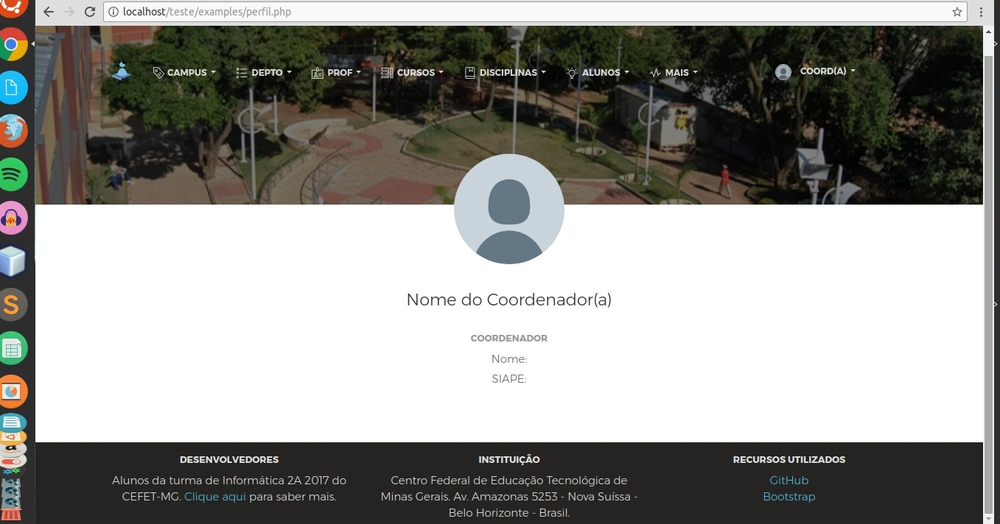
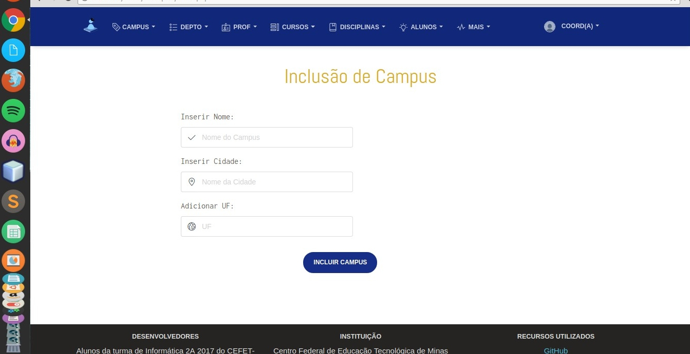

# Padrão Web Bootstrap

Todos os arquivos '.html' deverão ser feitos '.php'. Para isso, crie um arquivo '.php' e o edite como um '.html'. O php referente ao trabalho de vocês continuará sendo em um arquivo php externo. O html só será .php devido ao uso de algumas variáveis em php necessárias para o login sem o uso de js.

# Padrão Web - Perfil

Código da gerencia que será disponibilizado

# Importação Bootstrap

    <!-- CSS do Bootstrap -->
    <link href="css/bootstrap.min.css" rel="stylesheet" />
    <link href="css/bootstrap.css" rel="stylesheet"/>
    
    <!-- CSS do grupo -->
     <link href="" rel="stylesheet" />
	
    <!-- Arquivos js -->
    
    
    

    <!-- Fontes e icones -->
    <link href="css/nucleo-icons.css" rel="stylesheet">
    
   Existem outros recursos nas pastas do Bootstrap que poderão ser utilizadas caso alguém queira como o jQuery UI e arquivos separados de datepiker (uma função de data muito legal e bonita).
   
# Importante

Todo html deve estar contido dentro da div com a class="wrapper" que empurra o contudo da página qunado o menu  está responsivo! 

# Padrão Web - Botão

O botão será  chamado entre duas divs, a primeira delimita um espaço na tela de uma linha, ou seja, tudo que for colocado nessa div deve ficar em uma linha na tela e a div com a classe col-md-4 ml-auto mr-auto, usadas no bootstrap para garantir responsividade. Existem vários tipo de col-md.  (as '' são para impedir que o arquivo.md converta o botão)

# Codigo do padrao bottun 
	

  		

    			<'button type="button" class="btn btn-info btn-round">Botao</button>
  		

   	

 
 O css usado foram classes nativas do bootstrap modificadas:
 
 # css dos botoes
 	.btn-info {
          background-color: #162e87;
          border-color: #162e87;
          color: #FFFFFF;
          opacity: 1;
          filter: alpha(opacity=100);
         }
	
       .btn-info:hover, .btn-info:focus, .btn-info:active, .btn-info.active, .show > .btn-info.dropdown-toggle {
          background-color: #11277a;
          color: #FFFFFF;
          border-color: #11277a;
        }

# Padrão Web - Formulário

 Para o trabalho ficar mais "bunitin" nós usaremos icones nos form. Para isso segue uma lista do que temos disponíveis para vocês darem aquele ctrl c + ctrl v. A escolha dos icones será livre desde que faça sentido!
 
  * nc-air-baloon
  * nc-album-2
  * nc-alert-circle-i
  * nc-align-center
  * nc-align-left-2
  * nc-ambulance
  * nc-app
  * nc-atom
  * nc-badge
  * nc-bag-16
  * nc-bank
  * nc-basket
  * nc-bell-55
  * nc-bold
  * nc-book-bookmark
  * nc-bookmark-2
  * nc-box-2
  * nc-box
  * nc-briefcase-24
  * nc-bulb-63
  * nc-bullet-list-67
  * nc-bus-front-12
  * nc-button-pause
  * nc-button-play
  * nc-button-power
  * nc-calendar-60
  * nc-camera-compact
  * nc-caps-small
  * nc-cart-simple
  * nc-chart-bar-32
  * nc-chart-pie-36
  * nc-chat-33
  * nc-check-2
  * nc-circle-10 
  * nc-cloud-download-93
  * nc-cloud-upload-94
  * nc-compass-05
  * nc-controller-modern
  * nc-credit-card
  * nc-delivery-fast
  * nc-diamond
  * nc-email-85
  * nc-favourite-28
  * nc-glasses-2
  * nc-globe-2
  * nc-globe
  * nc-hat-3
  * nc-headphones
  * nc-html5
  * nc-image
  * nc-istanbul
  * nc-key-25
  * nc-laptop
  * nc-layout-11
  * nc-lock-circle-open
  * nc-map-big
  * nc-minimal-down
  * nc-minimal-left
  * nc-minimal-right
  * nc-minimal-up
  * nc-mobile
  * nc-money-coins
  * nc-note-03
  * nc-palette
  * nc-paper
  * nc-pin-3
  * nc-planet
  * nc-refresh-69
  * nc-ruler-pencil
  * nc-satisfied
  * nc-scissors
  * nc-send
  * nc-settings-gear-65
  * nc-settings
  * nc-share-66
  * nc-shop
  * nc-simple-add
  * nc-simple-delete
  * nc-simple-remove
  * nc-single-02
  * nc-single-copy-04
  * nc-sound-wave
  * nc-spaceship
  * nc-sun-fog-29
  * nc-support-17
  * nc-tablet-2
  * nc-tag-content
  * nc-tap-01
  * nc-tie-bow
  * nc-tile-56
  * nc-time-alarm
  * nc-touch-id
  * nc-trophy
  * nc-tv-2
  * nc-umbrella-13
  * nc-user-run
  * nc-vector
  * nc-watch-time
  * nc-world-2
  * nc-zoom-split
  
  Segue o que esses códigos geram:
  
   
   
   
   
   
   Para adicionar esses ícones é necessário chamar outra classe junto com ele, a nc-icon além dessa chamada ser realizada dentro da tag i no html. Por definição nós usaremos a tag span que receberá também um classe e dentro dela a tag i para ficar um efeito com o input. Exemplificando o código será da seguinte maneira: 
  
  # chamada de icons
  	
		<i class="nc-icon nc-check-2"></i>
  	
  
  Os input deverão chamar a classe form-control e utilizarem do recurso placeholder que deixa dentro do input um value que diz o que é para ser inserido e o required que não permite que o campo seja enviado vazio.
  
  # input 
  	<input type="text" class="form-control" placeholder="Insira alguma coisa" required='required'>
  
  O input juntamente com o span deverá ser dentro de uma div que chamará a classe input-group.
  Além disso o nome do que seu input faz deve ser chamada dentro da tag label:
  
  # label
  	<label class="fonteTexto">Insira alguma coisa:</label>
  
  A classe fonteTexto serve para definir a fonte e o tamanho da letra usados no input. o trecho de código é:
  
  # css da font
  	.fonteTexto{
           font-family: 'Inconsolata', monospace;
           font-size: 16px;
        }
 
  E todo esse trecho de código ficará dentro de outra div  que chama a classe col-md-6. Essa classe é uma das mais importantes para o form pois garante a responsividade. Exemplificando o trecho de código:
  
 # Exemplificação do código
 	

    		<label class="fonteTexto">Insera qualquer coisa:</label>
		

	   		
	      			<i class="nc-icon nc-check-2"></i>
	    		
	    		<input type="text" class="form-control" placeholder="Insira alguma coisa" required='required'>
		

  	

  
  O form deverá chamar a classe contact-form e o título do seu formulário em um h2 chamando a classe text-center.
  A classe text-center é nativa do bootstrap e sofreu algumas alterações para ser usada no trabalho:
  
  # css text-center
  	.text-center{
           font-family: 'Abel', sans-serif;
           color: #d8ac29;
        }
	
 O link do google fonts responsável pela letra do text-center e fontTexto é:
 
 # link google fonts
 	<link href="https://fonts.googleapis.com/css?family=Abel|Inconsolata" rel="stylesheet">
 
 Por fim o formulário deverá estar entre divs mais comuns do Bootstrap: container e row, elas são responsáveis por delimitar os campos na tela e outras duas que chamam as classes col-md-8 ml-auto mr-auto que permite que o h2 fique alinhado com os inputs além de interfeirir no tamanho deles como um todo e a div que chama a classe section landing-section que carante a integridade do código em relação ao bloco do form com o rodapé e menu.
 
 Exemplificação do trecho de código:
 
 # Exemplo de form completo
 	

 		

        		

                        	

                            		<h2 class="text-center">Qualquer Coisa<'/h2>
                            			<form class="contact-form">
                                    			

                                        			<label class="fonteTexto">Insera qualquer coisa:</label>
								

									
										<i class="nc-icon nc-check-2"></i>
									
								<input type="text" class="form-control" placeholder="qualquer coisa" required='required'>
								

						       

                            			</form>
                        	

                 	

         	

   	

        

# Exemplo de Formulário Funcional:
 
 
 
# NA PASTA IMAGE DO REPOSITÓRIO HAVERÁ UM CÓDIGO DE EXEMPLO DE FORMULÁRIO.

# Padrão Alerts
	

	    	

		    	

		      		

		        		

		          			<button type="button" class="close" data-dismiss="modal">&times;</button>
		          			<h4 class="modal-title">Alerta TOP</h4>
		        		

		        		

		          			
Exemplo de alerta com model usando o famigerado bootstrap+jquery

		       	 		

		        		

		          			<button type="button" class="btn btn-info btn-round" data-dismiss="modal">Fechar</button>
		        		

		      		
      
		    	

		  	

	   
  

id alerta é usado para ser chamado no botão que irá invocar o alert. A invocação no botão é feita da seguinte forma:

# Invocação do model
	<'button type="button" class="btn btn-info btn-round" data-toggle="modal" data-target="#alerta">Alerta</button>

# Padrão Tabelas
