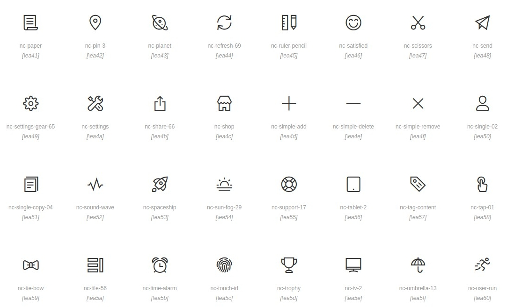
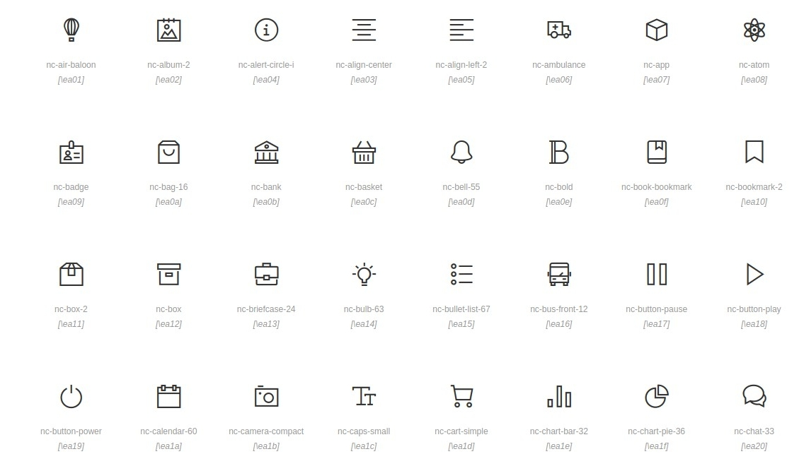

# Padrão Web Bootstrap

Todos os arquivos '.html' deverão ser feitos '.php'. Para isso, crie um arquivo '.php' e o edite como um '.html'. O php referente ao trabalho de vocês continuará sendo em um arquivo php externo. O html só será .php devido ao uso de algumas variáveis em php necessárias para o login sem o uso de js.

# Padrão Web - Perfil

Código da gerencia que será disponibilizado

# Padrão Web - Formulário

 Para o trabalho ficar mais "bunitin" nós usaremos icones nos form. Para isso segue uma lista do que temos disponíveis para vocês darem aquele ctrl c + ctrl v. A escolha dos icones será livre desde que faça sentido!
 
  * nc-air-baloon
  * nc-album-2
  * nc-alert-circle-i
  * nc-align-center
  * nc-align-left-2
  * nc-ambulance
  * nc-app
  * nc-atom
  * nc-badge
  * nc-bag-16
  * nc-bank
  * nc-basket
  * nc-bell-55
  * nc-bold
  * nc-book-bookmark
  * nc-bookmark-2
  * nc-box-2
  * nc-box
  * nc-briefcase-24
  * nc-bulb-63
  * nc-bullet-list-67
  * nc-bus-front-12
  * nc-button-pause
  * nc-button-play
  * nc-button-power
  * nc-calendar-60
  * nc-camera-compact
  * nc-caps-small
  * nc-cart-simple
  * nc-chart-bar-32
  * nc-chart-pie-36
  * nc-chat-33
  * nc-check-2
  * nc-circle-10 
  * nc-cloud-download-93
  * nc-cloud-upload-94
  * nc-compass-05
  * nc-controller-modern
  * nc-credit-card
  * nc-delivery-fast
  * nc-diamond
  * nc-email-85
  * nc-favourite-28
  * nc-glasses-2
  * nc-globe-2
  * nc-globe
  * nc-hat-3
  * nc-headphones
  * nc-html5
  * nc-image
  * nc-istanbul
  * nc-key-25
  * nc-laptop
  * nc-layout-11
  * nc-lock-circle-open
  * nc-map-big
  * nc-minimal-down
  * nc-minimal-left
  * nc-minimal-right
  * nc-minimal-up
  * nc-mobile
  * nc-money-coins
  * nc-note-03
  * nc-palette
  * nc-paper
  * nc-pin-3
  * nc-planet
  * nc-refresh-69
  * nc-ruler-pencil
  * nc-satisfied
  * nc-scissors
  * nc-send
  * nc-settings-gear-65
  * nc-settings
  * nc-share-66
  * nc-shop
  * nc-simple-add
  * nc-simple-delete
  * nc-simple-remove
  * nc-single-02
  * nc-single-copy-04
  * nc-sound-wave
  * nc-spaceship
  * nc-sun-fog-29
  * nc-support-17
  * nc-tablet-2
  * nc-tag-content
  * nc-tap-01
  * nc-tie-bow
  * nc-tile-56
  * nc-time-alarm
  * nc-touch-id
  * nc-trophy
  * nc-tv-2
  * nc-umbrella-13
  * nc-user-run
  * nc-vector
  * nc-watch-time
  * nc-world-2
  * nc-zoom-split
  
  Segue o que esses códigos geram:
  
   
   
   
   
   
   Para adicionar esses ícones é necessário chamar outra classe junto com ele, a nc-icon além dessa chamada ser realizada dentro da tag i no html. Por definição nós usaremos a tag span que receberá também um classe e dentro dela a tag i para ficar um efeito com o input. Exemplificando o código será da seguinte maneira: (as '' são para impedir que o arquivo.md converta as tags html)
  
  # <'span class="input-group-addon">
	# <'i class="nc-icon nc-check-2"><'/i>
  # <'/span>
  
  Os input deverão chamar a classe form-control e utilizarem do recurso placeholder que deixa dentro do input um value que diz o que é para ser inserido e o required que não permite que o campo seja enviado vazio.
  
  <'input type="text" class="form-control" placeholder="Insira alguma coisa" required='required'>
  
  O input juntamente com o span deverá ser dentro de uma div que chamará a classe input-group.
  Além disso o nome do que seu input faz deve ser chamada dentro da tag label:
  
  <'label class="fonteTexto">Insira alguma coisa:</label>
  
  A classe fonteTexto serve para definir a fonte e o tamanho da letra usados no input. o trecho de código é:
  
  '.fonteTexto{
           font-family: 'Inconsolata', monospace;
           font-size: 16px;
        }
 
  E todo esse trecho de código ficará dentro de outra div  que chama a classe col-md-6. Essa classe é uma das mais importantes para o form pois garante a responsividade. Exemplificando o trecho de código:
  
  <'div class="col-md-6">
    <'label class="fonteTexto">Insera qualquer coisa:</label>
	<'div class="input-group">
	   <'span class="input-group-addon">
	      <'i class="nc-icon nc-check-2"><'/i>
	    <'/span>
	    <'input type="text" class="form-control" placeholder="Insira alguma coisa" required='required'>
	

  

# Exemplo de Formulário Funcional:
 
 
 
